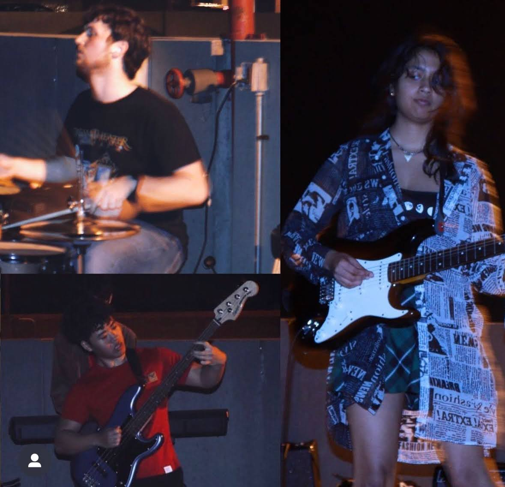

## The Problem and the Idea

As someone who's been involved in a band, I've been made acutely aware of both the bulk and setup overhead involved with running a live gig. 
This includes but is not limited to: 
* Lugging around two cars worth of amps, pedalboards, synths, cables, etc.
* Plugging in a rats nest of cables
* Repeatedly yelling at guitarists to turn their amps up and down. 
    * The real life version of binary search (but for gain staging)

Getting everyone plugged in and set up + bashing out a competent mix requires some inhuman amount of patience and speed. As a musician and engineer, I felt that there had to be a way to optimize this workflow. 
The somewhat straightforward solution is to plug into a single mixer board and run everything through a PA. This improves on some aspects of setup. A consolidated control center and patch bay definitely improves the speed
of achieving a competent mix. However, many challenges associated with gain staging, effects, and parameter recall aren't really solved until you start getting into the realm of expensive digital mixers. 
So, I had an idea. I am working alongside some of my fellow band members to bring to life an economical digital mixer with an AI powered auto-mix algorithm to streamline this process. What does this look like in design? 
Keep reading, and I'll explain the details. 

## Form Factor

